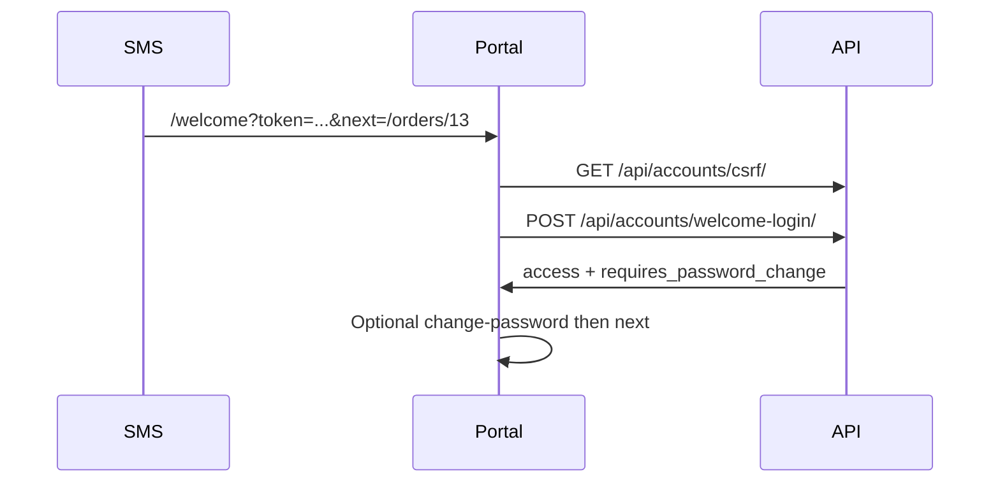

# Frontend: welcome / portal SMS magic login

Customers receive an SMS with a **reusable magic link** (valid until expiry, default **30 days**). Tapping it should open the portal without typing credentials. Normal username/password login remains the fallback when the link expires.

**Magic links are client-only.** Admin, employee, and superadmin accounts never receive a `/welcome?token=…` link.

## Phone numbers (Ghana)

| Form | Example |
|------|---------|
| Local 10 digits starting with `0` | `0502412618` |
| International `+233` + 9 digits | `+233502412618` |

Anything else is rejected with `400 VALIDATION_ERROR` on create/update.

SMS goes through an **outbox**: immediate send, then retry every **2 hours** on transient Moolre failures. If Moolre says the number is invalid / does not exist, the customer is marked `phone_needs_correction` and staff cannot create orders for them until the phone is updated.

Links appear on:

- Staff customer create (welcome SMS)
- Order received SMS (includes `next=/orders/{orderId}` so the portal can open that order after login)

## Staff roles (no magic link)

When creating **admin**, **employee**, or **superadmin**:

| Field | Rule |
|-------|------|
| `phone_number` | **Compulsory** (Ghana format) — omit/blank/invalid → `400` |
| SMS | Username + temporary password `Kolendo@{username}` + “keep credentials secret” (outbox + 2h retry) |
| Magic link | **None** |
| API `default_password` | Still returned so the creator can see it |

Staff create UI must collect a phone number. Do not build or expect a welcome/magic-login flow for staff.

## Flow

1. SMS: `{CUSTOMER_APP_URL}/welcome?token={rawToken}` or with deep link  
   `{CUSTOMER_APP_URL}/welcome?token={rawToken}&next=/orders/{orderId}`
2. Portal route `/welcome` reads `token` and optional `next`
3. CSRF → `POST /api/accounts/welcome-login/` with `{ "token": "..." }`
4. Store `access` JWT; refresh cookie is set HttpOnly by the API
5. If `requires_password_change === true`, send user to change-password first
6. Then navigate to `next` if it is a same-origin relative path starting with `/` (e.g. `/orders/13`); otherwise home



## API contract

### `POST /api/accounts/welcome-login/`

Auth: **CSRF only** (same as login) — `csrf_token` cookie + `X-CSRF-Token` header. No Bearer JWT.

Rate-limited per IP (default 20 / 15 minutes).

Request:

```json
{ "token": "<value from ?token=>" }
```

Success `200` (same as login):

```json
{
  "access": "<jwt>",
  "user": { "id": 1, "username": "client_jane", "role": "client" },
  "requires_password_change": true,
  "message": "Please change your default password"
}
```

Errors:

| Status | `error_code` | When |
|--------|--------------|------|
| 400 | `MISSING_FIELDS` | No `token` |
| 401 | `INVALID_TOKEN` | Unknown or expired |
| 403 | `CSRF_VALIDATION_FAILED` | Missing/mismatched CSRF |
| 429 | `RATE_LIMIT_EXCEEDED` | Too many attempts |

Token rules (backend):

- **Reusable** until expiry (same link works on multiple taps)
- Expires after **30 days** by default (`WELCOME_LOGIN_TOKEN_TTL_HOURS`, default `720`)
- Stored hashed; raw token only in SMS

## Portal implementation checklist

- [ ] Route `/welcome` reads `token` and optional `next` (**clients only**)
- [ ] Call CSRF then welcome-login (with credentials / cookie jar)
- [ ] Persist access token the same way as password login
- [ ] On `requires_password_change`, complete change-password before following `next`
- [ ] Only follow `next` when it is a relative path starting with `/` (reject `http://…`)
- [ ] On `INVALID_TOKEN`, show “link expired” and offer normal login
- [ ] Do **not** put the default password in the URL
- [ ] Staff create forms (admin / employee / superadmin): require `phone_number`; show returned `default_password`; no magic-link UI

## Fallback

If the link expires, welcome SMS includes username + temporary password `Kolendo@{username}` for `POST /api/accounts/login/`. After password change, use the normal login form.
