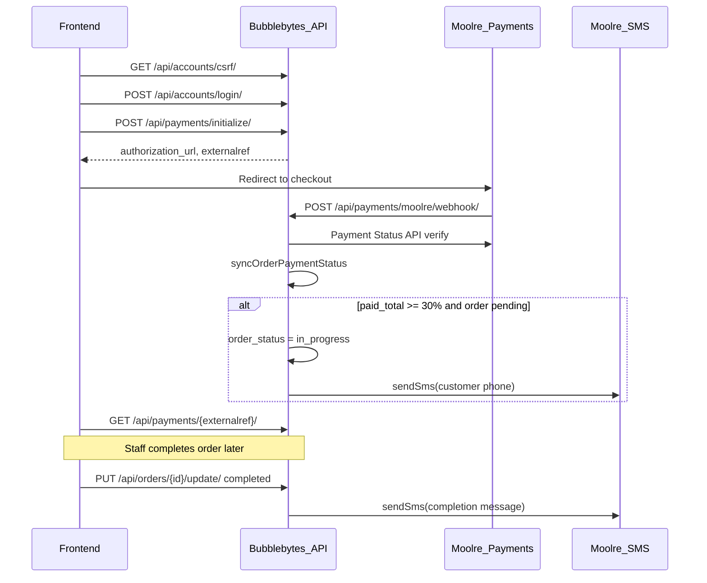

# Payment and SMS flow (frontend to customer notification)

This document describes the end-to-end path from a client paying for an order through Moolre to the customer receiving SMS updates. SMS is a **server-side side effect** — there is no public SMS API route.

## Overview

| Flow | Auth | Payment init | SMS triggers |
|------|------|--------------|--------------|
| **Web client** | CSRF + JWT (`client` role) | `POST /api/payments/initialize/` | After Moolre confirms payment (≥30% → `in_progress`) and when staff marks `completed` |
| **USSD** | None (phone lookup) | `POST /api/ussd/payments/initialize/` | Same post-payment behavior as web |

Swagger UI at `/api/docs` documents these endpoints and notes SMS as side effects on payment and order-update operations.

## Prerequisites

### Payment (Moolre)

Configure in `.env`:

- `MOOLRE_API_USER`, `MOOLRE_API_PUBKEY`, `MOOLRE_ACCOUNT_NUMBER`
- `MOOLRE_WEBHOOK_URL` → must point to `POST /api/payments/moolre/webhook/`
- `MOOLRE_WEBHOOK_SECRET` — validated on each webhook
- `MOOLRE_REDIRECT_URL` — optional frontend page after checkout

### SMS (Moolre)

- `MOOLRE_SMS_VAS_KEY` — `X-API-VASKEY` for Moolre SMS API
- `MOOLRE_SMS_SENDER_ID` — approved sender ID (max 11 characters)

### Data

- Customer must have `phone_number` on their profile (used as SMS recipient, formatted to `233…`).
- Order must belong to the paying customer and have `payment_status` other than fully paid.

## Step-by-step: web client flow

### 1. Authenticate

```
GET  /api/accounts/csrf/
POST /api/accounts/login/     (X-CSRF-Token header + csrf_token cookie)
```

Store the `access` JWT for subsequent requests.

### 2. Initialize payment

```
POST /api/payments/initialize/
Authorization: Bearer <access>

{
  "order_id": 2,
  "amount": 3.00
}
```

**Response (200):**

```json
{
  "status": "success",
  "message": "Payment initialized successfully",
  "data": {
    "authorization_url": "https://pay.moolre.com/...",
    "externalref": "PAY-2-XXXXXXXXXXXX",
    "payment_id": 1
  }
}
```

### 3. Redirect to Moolre

Send the user to `data.authorization_url` to complete Mobile Money or card payment.

### 4. Moolre webhook (server-side)

Moolre calls your configured webhook:

```
POST /api/payments/moolre/webhook/
```

The server:

1. Validates `data.secret` against `MOOLRE_WEBHOOK_SECRET`
2. Looks up the payment by `externalref`
3. **Does not trust** webhook `txstatus` — confirms via Moolre Payment Status API (`idtype: 1`)
4. Marks payment `paid` and runs `syncOrderPaymentStatus`:
   - Updates `amount_paid` and `payment_status` on the order
   - If cumulative paid ≥ **30%** of `total_amount` and order is still **`pending`**:
     - Sets `order_status` to **`in_progress`**
     - Writes `order_status_history`
     - Sends **in-progress SMS** to `Customer.phone_number` (async, non-blocking)

Reconciliation cron (every 2 minutes) can also confirm pending payments if the webhook is delayed.

### 5. Frontend polls payment status

```
GET /api/payments/{externalref}/
```

**Response:**

```json
{ "status": "PENDING" }
```

Poll until `PAID` (or `FAILED`). When `PAID`, the order may already be `in_progress` and the customer may have received the in-progress SMS.

### 6. Staff completes the order

When laundry work is done, staff updates the order:

```
PUT /api/orders/{id}/update/
Authorization: Bearer <staff access>

{ "order_status": "completed" }
```

This triggers a **completion SMS** asynchronously:

> Your order ORD-XXXX is ready for pickup/delivery. Thank you.

## SMS details

| Item | Source |
|------|--------|
| Sender ID | `MOOLRE_SMS_SENDER_ID` env var |
| Recipient | `Customer.phone_number` from DB → formatted to `233XXXXXXXXX` |
| In-progress message | `Your order {order_number} is now in progress. Thank you for choosing us.` |
| Completed message | `Your order {order_number} is ready for pickup/delivery. Thank you.` |
| Moolre API | `POST https://api.moolre.com/open/sms/send` with `X-API-VASKEY` |

SMS is sent **once per status transition** (no duplicate in-progress SMS on further payments once already `in_progress`).

If SMS fails, the server logs `order_sms_failed` and the payment/order API still returns success.

## USSD variant

Interactive menu (configure in Moolre dashboard):

```
POST https://<your-host>/api/ussd/callback/
```

Live Moolre may send `application/x-www-form-urlencoded` with the JSON payload embedded as a single form field key (not separate fields). The API normalizes this before handling. The simulator typically sends `application/json` directly. The `new` flag may arrive as `1` or `true` for a new session.

No login or CSRF required for direct payment init:

```
POST /api/ussd/payments/initialize/

{
  "phone_number": "0502412618",
  "order_id": 2,
  "amount": 3.00
}
```

Same response shape (`authorization_url`, `externalref`). After Moolre confirms payment via webhook, the same 30% / SMS logic applies.

## Sequence diagram



## Postman quick reference

Development seed (when `NODE_ENV=development` on `npm start`):

| Field | Value |
|-------|--------|
| Username | `postman_client` |
| Password | `Postman123!` |
| Phone | `0502412618` |
| Order ID | `2` |
| Sample amount | `0.50` or `3.00` (for 30% test on a GHS 10 order) |

**Request chain:**

1. `GET {{baseUrl}}/api/accounts/csrf/` — save `csrf_token`
2. `POST {{baseUrl}}/api/accounts/login/` — header `X-CSRF-Token: {{csrf_token}}`
3. `POST {{baseUrl}}/api/payments/initialize/` — header `Authorization: Bearer {{access}}`
4. Open `authorization_url` in browser and pay
5. `GET {{baseUrl}}/api/payments/{{externalref}}/` — poll until `PAID`
6. (Staff) `PUT {{baseUrl}}/api/orders/2/update/` — `{ "order_status": "completed" }`

## Related code

| Concern | File |
|---------|------|
| Payment init / webhook | `services/paymentService.js` |
| 30% auto-`in_progress` | `services/orderService.js` → `syncOrderPaymentStatus` |
| SMS send | `services/orderNotificationService.js`, `services/moolreService.js` |
| OpenAPI / Swagger | `scripts/generate-openapi-spec.js`, `docs/openapi.json` |
