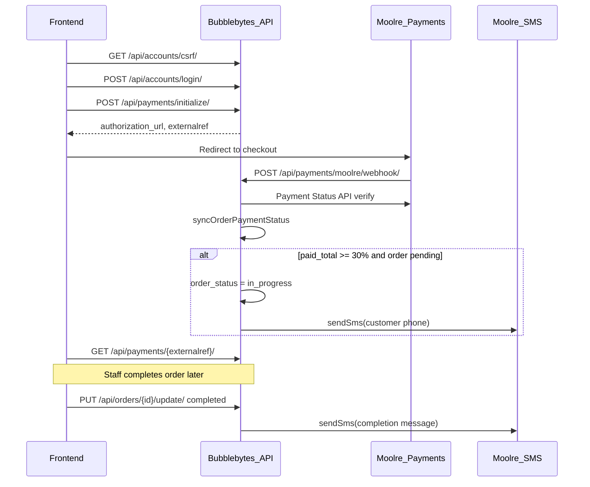

# Payment and SMS flow (frontend to customer notification)

This document describes the end-to-end path from a client paying for an order through Moolre to the customer receiving SMS updates. SMS is a **server-side side effect** — there is no public SMS API route.

## Overview

| Flow | Auth | Payment init | SMS triggers |
|------|------|--------------|--------------|
| **Web client** | CSRF + JWT (`client` role) | `POST /api/payments/initialize/` | Receipt SMS on **full pay** only (customer + superadmin); ≥30% sets `in_progress` **without SMS**; staff `completed` SMS |
| **USSD** | None (phone lookup) | `POST /api/ussd/payments/initialize/` | Same as web (receipt SMS on **full pay** only) |
| **Cash (staff)** | JWT (`admin` / `employee` / `superadmin`) | `POST /api/payments/cash/` | Full-pay receipt to **superadmin only** (not customer); ≥30% sets `in_progress` without SMS |

### Payment status

Order `payment_status` is **server-computed** from paid Payment rows (not settable on create/update):

| Status | Meaning |
|--------|---------|
| `pending` | `amount_paid` is 0 |
| `partially_paid` | Some paid, but balance remains (show as “partial” in the UI) |
| `paid` | Fully paid |

Frontend guide: [frontend-partial-payment-status.md](./frontend-partial-payment-status.md).

### Staff cash payment

```
POST /api/payments/cash/
Authorization: Bearer <staff access>

{
  "order_id": 13,
  "amount": 50.00,
  "paid_at": "2026-08-03T14:30:00.000Z"
}
```

Creates a **paid** Payment row (`payment_method: cash`) with `created_by` = accepting staff and the given `paid_at`, then syncs order `amount_paid` / `payment_status` / `balance`.

**Receipt SMS (only when the order is fully `paid` — not on partials):**
- **Cash:** every active **superadmin** only (customer name + who received the cash). **The customer is not SMS’d for cash.**
- **MoMo / USSD:** customer + every active superadmin. MoMo copy includes customer name only (no cash-taker).
- **Admins and employees do not receive payment SMS.**

Status SMS: **completed**, schedule change, and pickup remain. **No in-progress SMS** (staff update or auto at ≥30% paid — the order status still changes).

### Due reminders (delivery)

Due-reminder SMS (24h / 1h before delivery) is **disabled**. The background job still runs but sends nothing.

Swagger UI at `/api/docs` documents these endpoints and notes SMS as side effects on payment and order-update operations.

## Prerequisites

### Payment (Moolre)

Configure in `.env`:

- `MOOLRE_API_USER`, `MOOLRE_API_PUBKEY`, `MOOLRE_ACCOUNT_NUMBER`
- `MOOLRE_WEBHOOK_URL` → must point to `POST /api/payments/moolre/webhook/`
- `MOOLRE_WEBHOOK_SECRET` — validated on each webhook
- `MOOLRE_REDIRECT_URL` — optional frontend page after checkout
- `MOOLRE_API_BASE` — API host (e.g. `https://api.moolre.com`)
- `MOOLRE_MERCHANT_EMAIL` — merchant email for Generate Payment Link
- `MOOLRE_PATH_EMBED_LINK`, `MOOLRE_PATH_TRANSACT_STATUS`, `MOOLRE_PATH_TRANSACT_PAYMENT`, `MOOLRE_PATH_SMS_SEND` — path suffixes under `MOOLRE_API_BASE`
- `DEFAULT_CUSTOMER_PASSWORD` — **deprecated**; new staff-created passwords are `Kolendo@{username}` (see [frontend-portal-links-and-cash-payments.md](./frontend-portal-links-and-cash-payments.md))

### SMS (Moolre)

- `MOOLRE_SMS_VAS_KEY` — `X-API-VASKEY` for Moolre SMS API
- `MOOLRE_SMS_SENDER_ID` — approved sender ID (max 11 characters)

### Data

- Customer must have `phone_number` on their profile (used as SMS recipient, formatted to `233…`).
- Ghana format required: **10 digits starting with `0`**, or **`+233` + 9 digits** (length 13).
- If Moolre reports an invalid/nonexistent number, `phone_needs_correction` is set and **new orders cannot be created** for that customer until staff updates the phone.
- SMS is queued in `sms_outbox` and retried every **2 hours** when Moolre is temporarily unavailable (`node scripts/processSmsOutbox.js` for a manual run).
- Order must belong to the paying customer and have `payment_status` other than fully paid.

## Step-by-step: web client flow

### 1. Authenticate

```
GET  /api/accounts/csrf/
POST /api/accounts/login/     (X-CSRF-Token header + csrf_token cookie)
```

Store the `access` JWT for subsequent requests.

### 2. Initialize payment

```
POST /api/payments/initialize/
Authorization: Bearer <access>

{
  "order_id": 2,
  "amount": 3.00
}
```

**Response (200):**

```json
{
  "status": "success",
  "message": "Payment initialized successfully",
  "data": {
    "authorization_url": "https://pay.moolre.com/...",
    "externalref": "PAY-2-XXXXXXXXXXXX",
    "payment_id": 1
  }
}
```

### 3. Redirect to Moolre

Send the user to `data.authorization_url` to complete Mobile Money or card payment.

### 4. Moolre webhook (server-side)

Moolre calls your configured webhook:

```
POST /api/payments/moolre/webhook/
```

The server:

1. Validates `data.secret` against `MOOLRE_WEBHOOK_SECRET`
2. Looks up the payment by `externalref`
3. **Does not trust** webhook `txstatus` — confirms via Moolre Payment Status API (`idtype: 1`)
4. Marks payment `paid` and runs `syncOrderPaymentStatus`:
   - Updates `amount_paid` and `payment_status` on the order
   - If cumulative paid ≥ **30%** of `total_amount` and order is still **`pending`**:
     - Sets `order_status` to **`in_progress`**
     - Writes `order_status_history`
     - **Does not** send in-progress SMS

Reconciliation cron (every 2 minutes) can also confirm pending payments if the webhook is delayed.

### 5. Frontend polls payment status

```
GET /api/payments/{externalref}/
```

**Response:**

```json
{ "status": "PENDING" }
```

Poll until `PAID` (or `FAILED`). When `PAID`, the order may already be `in_progress` (no in-progress SMS).

### 6. Staff completes the order

When laundry work is done, staff updates the order:

```
PUT /api/orders/{id}/update/
Authorization: Bearer <staff access>

{ "order_status": "completed" }
```

This triggers a **completion SMS** asynchronously:

> Your order ORD-XXXX is ready for pickup/delivery. Thank you.

## SMS details

| Item | Source |
|------|--------|
| Sender ID | `MOOLRE_SMS_SENDER_ID` env var |
| Recipient | `Customer.phone_number` from DB → formatted to `233XXXXXXXXX` |
| In-progress message | *(not sent)* |
| Completed message | `Your order {order_number} is ready for pickup/delivery. Thank you.` |
| Schedule earlier | `Your order {order_number} estimated completion was moved earlier to {date}. Good news — we'll finish sooner.` |
| Schedule later | `Sorry for the inconvenience. Your order {order_number} estimated completion is now {date}. We'll still complete your items carefully and on the updated schedule.` |
| Picked up | `Thank you for using our services. Your order {order_number} was picked up on {date} at {time}. We look forward to serving you again.` |
| Moolre API | `POST {MOOLRE_API_BASE}{MOOLRE_PATH_SMS_SEND}` with `X-API-VASKEY` |

SMS is sent on **completed**, schedule change, and pickup (not on `in_progress`). Changing `estimated_completion_date` or setting `picked_up: true` also sends SMS.

If SMS fails, the server logs `order_sms_failed` and the payment/order API still returns success.

## USSD variant

Interactive menu (configure in Moolre dashboard):

```
POST https://<your-host>/api/ussd/callback/
```

Live Moolre may send `application/x-www-form-urlencoded` with the JSON payload embedded as a single form field key (not separate fields). The API normalizes this before handling. The simulator typically sends `application/json` directly. The `new` flag may arrive as `1` or `true` for a new session.

**USSD payments use Moolre Initiate Payment** (`POST /open/transact/payment`), not the web payment link. On menu confirm, the server passes the Moolre USSD `sessionId` as `sessionid` to skip OTP and maps `network` to `channel` (3→13 MTN, 5→7 AT, 6→6 Telecel). Network is stored in the USSD session when first received. The `payer` field sent to Moolre uses local Ghana format (`0502412618`); customer SMS uses international `233…` format.

Direct API (no menu):

```
POST /api/ussd/payments/initialize/

{
  "phone_number": "0502412618",
  "order_id": 2,
  "amount": 3.00,
  "network": 6,
  "session_id": "4708826970"
}
```

- `network` — required (Moolre USSD network code)
- `session_id` — optional; skips OTP when set

Response has `externalref` and `moolre_message` — no `authorization_url`. Customer receives a Mobile Money PIN prompt on their phone.

Web client payments continue to use **Generate Payment Link** (`POST /embed/link`) via `POST /api/payments/initialize/`.

## Sequence diagram



## Postman quick reference

Postman auto-seed on server start has been **removed** (not used in production).

For local payment testing only, you can still run:

```bash
node scripts/recreatePostmanClient.js
```

| Field | Value (if recreated locally) |
|-------|--------|
| Username | `postman_client` |
| Password | `Kolendo@postman_client` (welcome SMS includes magic link + this password) |
| Phone | `0502412618` |
| Order ID | `2` (only if that order still exists) |
| Sample amount | `0.50` or `3.00` (for 30% test on a GHS 10 order) |

**Request chain:**

1. `GET {{baseUrl}}/api/accounts/csrf/` — save `csrf_token`
2. `POST {{baseUrl}}/api/accounts/login/` — header `X-CSRF-Token: {{csrf_token}}`
3. `POST {{baseUrl}}/api/payments/initialize/` — header `Authorization: Bearer {{access}}`
4. Open `authorization_url` in browser and pay
5. `GET {{baseUrl}}/api/payments/{{externalref}}/` — poll until `PAID`
6. (Staff) `PUT {{baseUrl}}/api/orders/2/update/` — `{ "order_status": "completed" }`

## Related code

| Concern | File |
|---------|------|
| Payment init / webhook | `services/paymentService.js` |
| 30% auto-`in_progress` | `services/orderService.js` → `syncOrderPaymentStatus` |
| SMS send | `services/orderNotificationService.js`, `services/moolreService.js` |
| OpenAPI / Swagger | `scripts/generate-openapi-spec.js`, `docs/openapi.json` |
